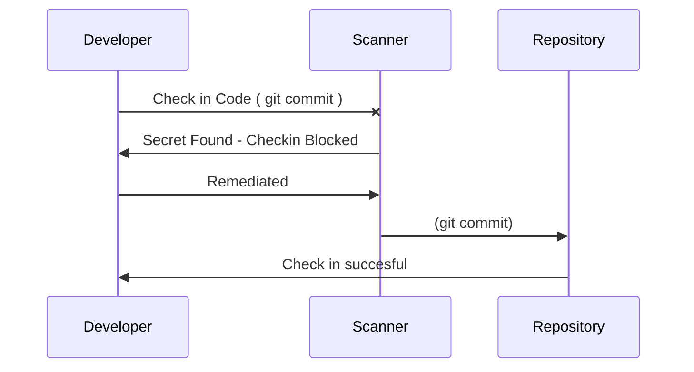
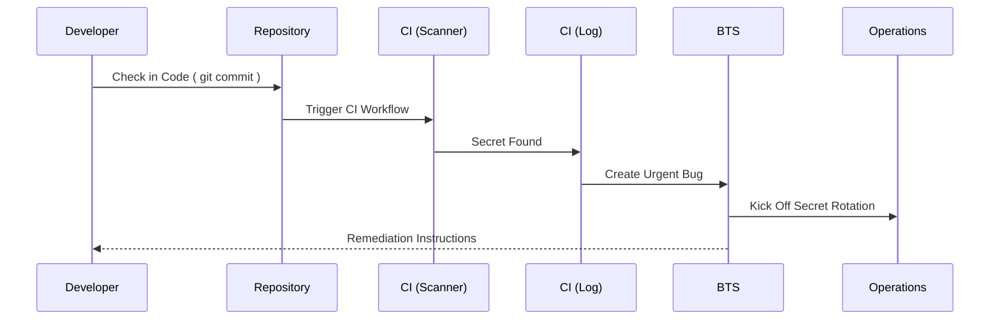

# Secrets Detection

Application and infrastructure source codes may contain exposed secrets that can pose a severe security risk and requires attention during development. Utilizing robust **secret detection** tools help mitigate this risk by probabilistically identifying whether strings in application code contain secrets. Early and automated detection of secrets in IaC and application code is critical and ideally should occur before code is committed to a repository and part of its history. Effective secret detection tools share several essential characteristics.

## Characteristics of effective Secret Detection Tools

- **Precision**: An effective secrets detection tool rarely produces false positive results. False positive results directly impact the level of trust that developers have for the tool.
- **Recall**: The tool rarely misses a secret. This reduces runtime and operational remediation.
- **Configurable**: False positives can be addressed in the code through annotation and does not slow developers down. Additionally, new patterns can be introduced to detect custom secrets not previously detectable to the tool

## Sample sequence - Early detection

In the example below, a secret detection tool with a pre-commit configuration option prevents the unintentional check-in of a secret in the repository.

## Sample sequence - Post Check-in detection

In the example below, the secret detection tool has been implemented as a step in a Continuous Integration (CI) pipeline and only detects the secret once the code is checked in. This is a far more involved workflow and demonstrates a potential remediation path that could prevent the leaked credential from being used maliciously by an attacker.

## Act on the results

It is important to act on the results of the scan immediately.

1. Triage the output from the scans to identify false positives and updated the configuration to avoid future occurances.
1. It is recommended that results determined as true secrets be marked as high-severity bugs/issues which must be remediated with urgency.
1. Document and track the remaining issues.
1. Secret rotation is a compulsory step once a secret has been exposed.

## Considerations

- **There is no single tool that can detect all possible types of credentials**. Implementing this type of credential scanning tool is helpful, but does not replace code reviews by other members of the team.
- Multiple tools should be evaluated in order to detect different types of credentials and select the one that best fits the needs of the project and the organization.
- Consider tuning and configuring the credential scanning tool before integrating it into a pipeline. This will help reduce the occurrence of false-positives and avoid false-negative results.

## Tool Selection Matrix

The table below has been populated with a selection of tools that have both high precision and recall as stated in the below table. It is important to note that other factors may influence your choices, such as the availability of an official GitHub Action that can be used in a Workflow or its ability to be used from a shell, among other things.

| Tool                                                                                                      | Command Line                                                                                         | Pre-commit hook                                                                | GitHub Action                                                                                                                                                                                                  | Azure DevOps Extension                                                                         | License                                                                                  | Repo Service |
|-----------------------------------------------------------------------------------------------------------|------------------------------------------------------------------------------------------------------|--------------------------------------------------------------------------------|----------------------------------------------------------------------------------------------------------------------------------------------------------------------------------------------------------------|------------------------------------------------------------------------------------------------|------------------------------------------------------------------------------------------|--------------|
| [GitHub Secrets Scanning](https://docs.github.com/en/code-security/secret-scanning/about-secret-scanning) | No                                                                                                   | No                                                                             | No                                                                                                                                                                                                             | No                                                                                             | commercial, required GitHub Enterprise Cloud with a license for GitHub Advanced Security | Yes          |
| [Yelp Detect-Secrets](https://github.com/Yelp/detect-secrets)                                             | [Yes](https://github.com/Yelp/detect-secrets#installation) (as python library)                       | [Yes](https://github.com/Yelp/detect-secrets#blocking-secrets-not-in-baseline) | [Yes](https://github.com/marketplace/actions/run-detect-secrets-with-reviewdog) (community, MIT)                                                                                                               | No                                                                                             | Apache 2.0                                                                               | No           |
| [TruffleHog](https://github.com/trufflesecurity/trufflehog)                                               | [Yes](https://github.com/trufflesecurity/trufflehog/releases/latest) (cli to download from releases) | [Yes](https://github.com/trufflesecurity/trufflehog#precommit-hook)            | - [OSS](https://github.com/marketplace/actions/trufflehog-oss) (official, AGPL 3.0) - [Enterprise](https://github.com/marketplace/actions/trufflehog-enterprise) (official, required TruffleHog Enterprise) | No                                                                                             | AGPL 3.0                                                                                 | No           |
| [GitLeaks](https://github.com/zricethezav/gitleaks)                                                       | [Yes](https://github.com/zricethezav/gitleaks/releases/latest) (cli to download from releases)       | [Yes](https://github.com/zricethezav/gitleaks#pre-commit)                      | - [Gitleaks](https://github.com/marketplace/actions/gitleaks) (official, commercial for organizations) - [Gitleaks Scanner](https://github.com/marketplace/actions/gitleaks-scanner) (community, MIT)       | [Yes](https://marketplace.visualstudio.com/items?itemName=Foxholenl.Gitleaks) (community, MIT) | MIT                                                                                      | No           |

## Code Sample

Here is a sample on how to use GitLeaks to detect secrets during the build process. The link below will direct you to an implementation sample that showcases the proper implementation of its capabilities.

- [Integrating Gitleaks into GitHub Workflow or Azure Pipeline](Recipes/Gitleaks.md)

An implementation of the automated secret detection pattern on an IaC pipeline is available in [this repository](https://github.com/microsoft/symphony).
In this case, the [validation step](https://github.com/microsoft/symphony/blob/main/.azure-pipelines/template.bicep.validate.yml) of the pipelines are using [GitLeaks](https://github.com/zricethezav/gitleaks) to scan the repository for leaked credentials and publish the results in as SARIF (Static Analysis Results Interchange Format) file, so it can be consumed by other static analysis tools.

## Additional Resources

- [OWASP Secrets Detection Guide](https://cheatsheetseries.owasp.org/cheatsheets/Secrets_Management_Cheat_Sheet.html#8-detection)

## Contributing

This project welcomes contributions and suggestions.  Most contributions require you to agree to a
Contributor License Agreement (CLA) declaring that you have the right to, and actually do, grant us
the rights to use your contribution. For details, visit <https://cla.opensource.microsoft.com>.

When you submit a pull request, a CLA bot will automatically determine whether you need to provide
a CLA and decorate the PR appropriately (e.g., status check, comment). Simply follow the instructions
provided by the bot. You will only need to do this once across all repos using our CLA.

This project has adopted the [Microsoft Open Source Code of Conduct](https://opensource.microsoft.com/codeofconduct/).
For more information see the [Code of Conduct FAQ](https://opensource.microsoft.com/codeofconduct/faq/) or
contact [opencode@microsoft.com](mailto:opencode@microsoft.com) with any additional questions or comments.

## Trademarks

This project may contain trademarks or logos for projects, products, or services. Authorized use of Microsoft trademarks or logos is subject to and must follow [Microsoft's Trademark & Brand Guidelines](https://www.microsoft.com/en-us/legal/intellectualproperty/trademarks/usage/general).
Use of Microsoft trademarks or logos in modified versions of this project must not cause confusion or imply Microsoft sponsorship.
Any use of third-party trademarks or logos are subject to those third-party's policies.
